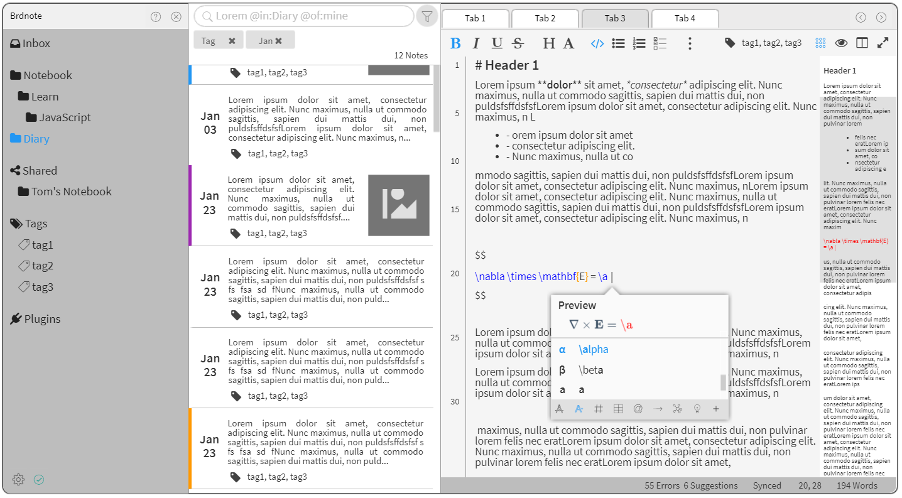
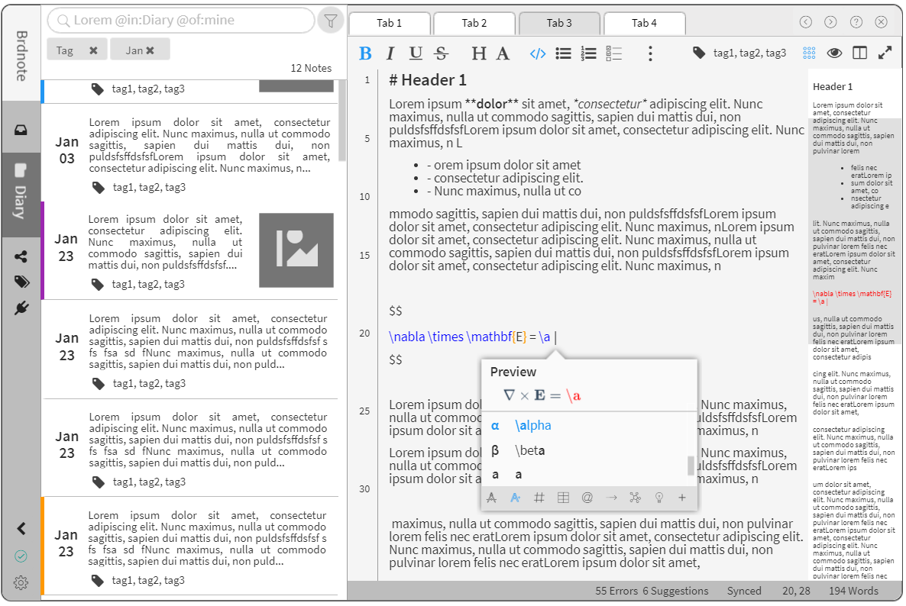
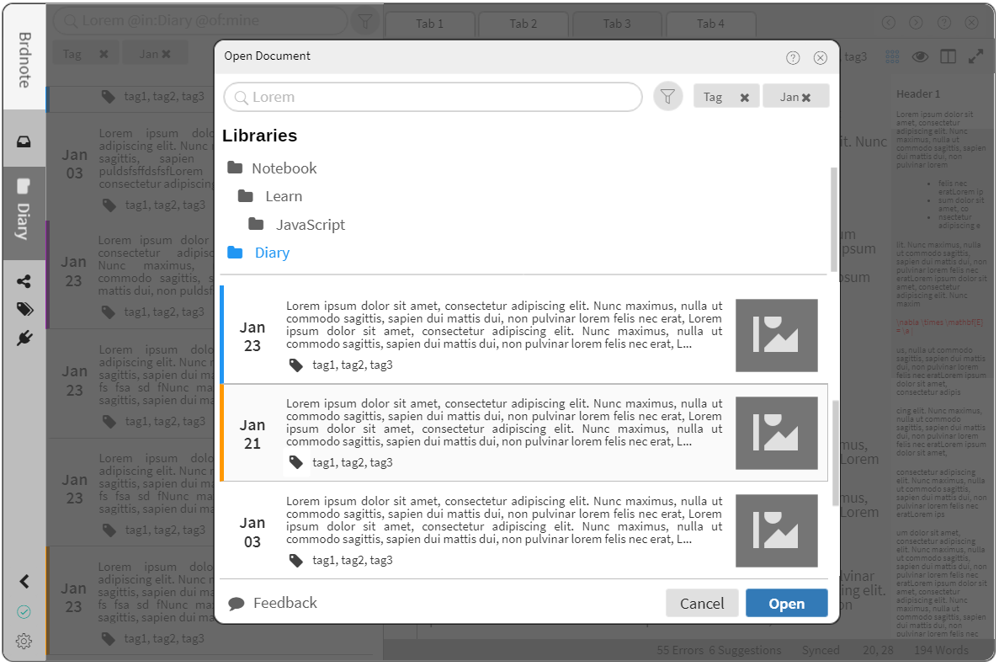

# brdnote

A desktop note taking app

## v0.x Releases

[Download](https://github.com/oxdc/brdnote/releases)

## Screenshot


## Features

+ Markdown shortcuts
+ Rich texts
+ KATEX supported
+ Embed videos and images

## Build Setup

``` bash
# install dependencies
npm install

# serve with hot reload at localhost:9080
npm run dev

# build electron application for production
npm run build

# lint all JS/Vue component files in `src/`
npm run lint
```

## Brdnote V1.0 Preview





